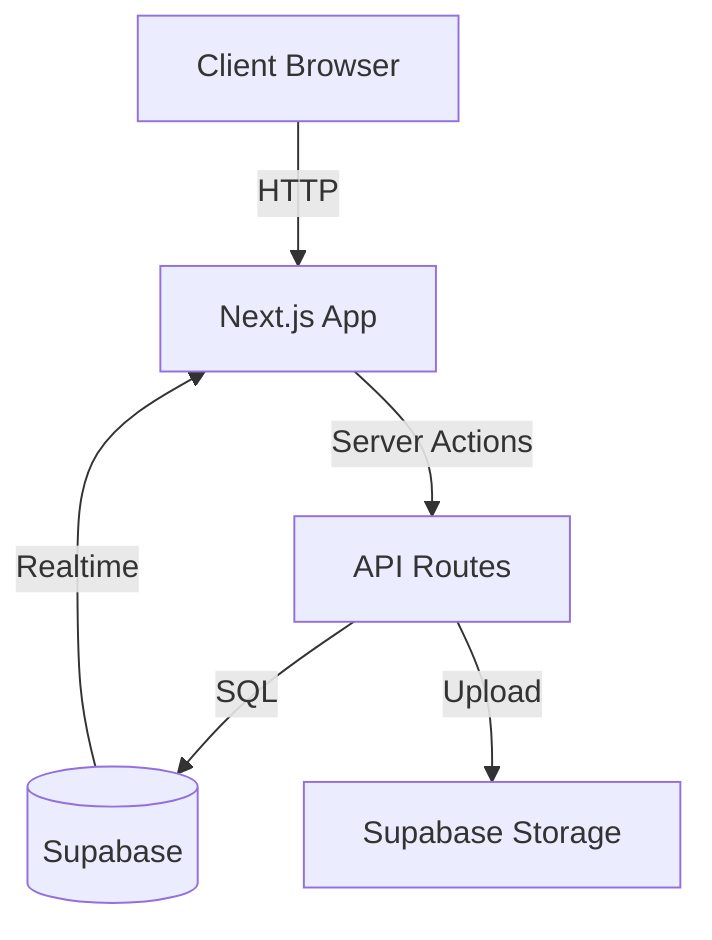
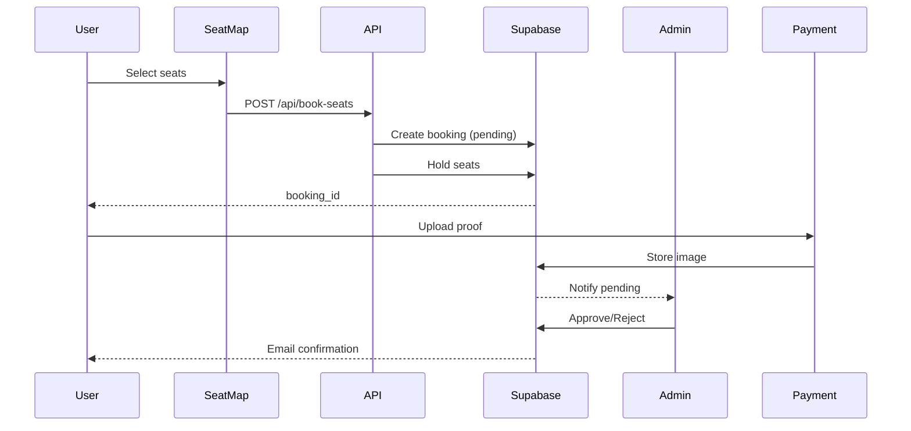

# Architecture Documentation

## System Overview

OG Event is a Next.js-based event ticketing and seat management system with real-time seat selection, booking workflows, payment verification, and administrative controls.

**Tech Stack**:

- **Frontend**: React 19, Next.js 16 (App Router), TypeScript
- **Styling**: Tailwind CSS, Radix UI
- **Backend**: Supabase (PostgreSQL, Auth, Storage, Realtime)
- **PDF Generation**: jsPDF, html2canvas

---

## Architecture Diagram



---

## Directory Structure

```
/app                    # Next.js App Router
  /api                 # API route handlers
  /auth                # Authentication pages
  /og-admin            # Admin panel
  /booking-confirmation
  /payment
  layout.tsx           # Root layout
  page.tsx             # Home page (seat map)

/components            # React components
  /seat-map           # Seat selection components
  /ui                 # Shadcn/Radix UI components

/lib                  # Utilities and configs
  /supabase          # Supabase clients
  pdf-utils.ts       # PDF generation
  storage.ts         # File uploads

/types                # TypeScript types
  seat.ts            # Seat/venue types
  booking.ts         # Booking types
  common.ts          # Shared types

/sql                  # Database scripts
/config               # App configuration
```

---

## Data Flow

### Booking Flow



### Real-time Updates

Seat status changes are broadcast via Supabase Realtime:

1. User books seats → status changes to "hold"
2. Supabase broadcasts change to all connected clients
3. Seat map updates automatically for all users
4. Prevents double-booking

---

## Core Components

### Seat Map System

**Location**: `/components/seat-map/`

**Key Components**:

- `seat-map.tsx` - Main container with pan/zoom
- `Zone.tsx` - Renders venue zones
- `Row.tsx` - Renders seat rows
- `Seat.tsx` - Individual seat component
- `BookingForm.tsx` - Booking form UI
- `legend.tsx` - Category legend

**State Management**:

- `useSeatSelection.ts` - Seat selection logic
- `useUIState.ts` - UI state (sidebar, fullscreen)

**Data Services**:

- `services.ts` - Supabase queries
- `utils/seatHelpers.ts` - Helper functions

### Admin Panel

**Location**: `/app/og-admin/`

**Pages**:

- `/bookings` - All bookings view
- `/pending-bookings` - Approval queue
- `/booked-orders` - Confirmed orders
- `/settings` - Event settings
- `/tickets` - Ticket designer

**Features**:

- Payment proof review
- Booking approval/rejection
- Ticket template customization
- PDF generation

---

## Database Schema

### Main Tables

**seats**:

```sql
- id (uuid)
- row_id (uuid) → rows.id
- seat_number (text)
- status (enum: available, booked, reserved, hold, pending_approval)
- category (text)
- booking_id (uuid) → bookings.id
- position_x, position_y, radius (numeric)
```

**rows**:

```sql
- id (uuid)
- zone_id (uuid) → zones.id
- row_number (text)
- position_x, position_y (numeric)
```

**zones**:

```sql
- id (uuid)
- venue_id (uuid)
- name (text)
- position_x, position_y, width, height (numeric)
```

**bookings**:

```sql
- id (uuid)
- name, email, phone (text)
- amount (numeric)
- status (enum: pending, approved, rejected, timeout)
- payment_proof_url (text)
- created_at, updated_at (timestamp)
```

**categories**:

```sql
- name (text, primary key)
- color (text)
- price (numeric)
```

### Relationships

- Seats belong to Rows
- Rows belong to Zones
- Zones belong to Venue
- Seats can have one Booking
- Bookings reference multiple Seats

---

## Authentication & Authorization

### Auth Flow

- **Provider**: Supabase Auth
- **Method**: Email/Password
- **Admin Access**: Protected by Row Level Security (RLS)

### Route Protection

**Public Routes**:

- `/` - Seat map
- `/booking-confirmation`
- `/payment/[id]`

**Protected Routes** (require auth):

- `/og-admin/*` - All admin pages

**Middleware**:

- `middleware.ts` - Checks auth for `/og-admin` routes
- Redirects to `/auth/login` if not authenticated

---

## State Management

### Approach

**Server State**:

- Supabase queries with Real-time subscriptions
- No additional state management library needed

**Client State**:

- React hooks (`useState`, `useEffect`)
- Custom hooks for reusable logic
- Context API for theme (next-themes)

**Form State**:

- Controlled components
- Local state in form components

### Real-time Subscriptions

```typescript
// Subscribe to seat updates
const subscription = supabase
  .channel('seats')
  .on('postgres_changes', { event: '*', schema: 'public', table: 'seats' }, payload => {
    // Update local state
  })
  .subscribe();
```

---

## File Storage

### Supabase Storage

**Buckets**:

- `payment-proofs` - Payment proof images
- `tickets` - Generated ticket PDFs

**Upload Flow**:

1. Client selects file
2. Upload to Supabase Storage via API
3. Get public URL
4. Save URL to database

**Security**:

- RLS policies on storage buckets
- Admin-only access to payment proofs
- Public access to approved tickets

---

## API Routes

### Route Structure

**Booking APIs**:

- `POST /api/book-seats` - Create booking
- `POST /api/approve-booking` - Approve booking (admin)
- `POST /api/reject-booking` - Reject booking (admin)

**Ticket Generation**:

- `POST /api/generate-tickets-pdf` - Combined ticket
- `POST /api/generate-separate-tickets-pdf` - Individual tickets

**Storage**:

- `POST /api/create-bucket` - Create storage bucket
- `GET /api/list-buckets` - List buckets
- `GET /api/image-proxy` - Proxy images

### Error Handling

All API routes follow consistent pattern:

```typescript
try {
  // Validation
  // Business logic
  return NextResponse.json({ success: true, data });
} catch (error) {
  return NextResponse.json({ success: false, error: error.message }, { status: 500 });
}
```

---

## Performance Considerations

### Optimizations

**Code Splitting**:

- Dynamic imports for admin panel
- Route-based splitting (automatic with App Router)

**Image Optimization**:

- Next.js Image component (where applicable)
- Lazy loading for seat SVGs

**Caching**:

- Static generation for marketing pages
- ISR for seat map data

### Bundle Size

Current approach:

- Main bundle: App Router pages
- Vendor bundle: React, Next.js
- Admin bundle: Admin-only code (code-split)

---

## Security

### Row Level Security (RLS)

Supabase RLS policies protect data:

- Users can only see/modify their own bookings
- Admin access controlled by auth role
- Seats visible to all, updates restricted

### Input Validation

- Client-side validation in forms
- Server-side validation in API routes
- Type checking with TypeScript

### Environment Variables

Sensitive data stored in environment variables:

- Supabase credentials
- Service role keys (server-only)

**Never committed**:

- `.env.local`
- Any files with actual credentials

---

## Deployment

### Build Process

```bash
npm run build    # Creates production build
npm run start    # Starts production server
```

### Environment Setup

Required environment variables:

```
NEXT_PUBLIC_SUPABASE_URL
NEXT_PUBLIC_SUPABASE_ANON_KEY
SUPABASE_SERVICE_ROLE_KEY
NEXT_PUBLIC_SITE_URL
```

### Hosting Recommendations

- **Vercel** (recommended) - Zero-config Next.js hosting
- **Netlify** - Alternative with good Next.js support
- **Self-hosted** - Docker container on VPS

---

## Monitoring & Logging

### Current Setup

**Console Logging**:

- Error logging in catch blocks
- Server-side logs in API routes

### Recommended Additions

- **Error Tracking**: Sentry or similar
- **Analytics**: Vercel Analytics or PostHog
- **Performance**: Vercel Speed Insights

---

## Future Architecture Improvements

### Potential Enhancements

1. **Testing**: Jest + React Testing Library
2. **State Management**: Zustand for complex client state
3. **Type Generation**: Auto-generate types from Supabase schema
4. **Caching**: React Query or SWR for data fetching
5. **Validation**: Zod schemas for runtime validation

---

## Getting Help

- **Issues**: Check GitHub issues
- **Documentation**: See README.md, CONTRIBUTING.md
- **Code**: Well-commented components and utilities
- **Types**: Centralized in `/types` directory

---

## References

- [Next.js Documentation](https://nextjs.org/docs)
- [Supabase Documentation](https://supabase.com/docs)
- [React Best Practices](https://react.dev/learn)
- [TypeScript Handbook](https://www.typescriptlang.org/docs/)
